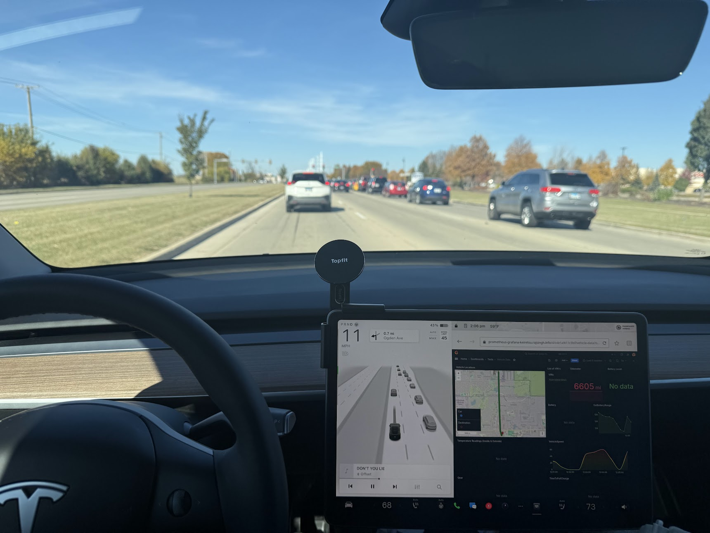

Hi there! My name is Raj Singh, and I’m a relentless tinkerer at heart. I thrive on diving deep into complex systems, breaking them apart (sometimes literally!) to uncover ways to make them better. My passion lies at the beautiful crossroads of Linux systems, Kubernetes, networking, and microservice architecture.

I’m driven by curiosity and an obsession with learning. Whether it’s debugging a stubborn Kubernetes cluster issue, writing code, or exploring IP allocation strategies, I love the challenge of turning chaos into clarity.

A glimpse of who I am and what I do can be seen in my personal projects. For instance, I’ve built an entire stack to process my Tesla’s telemetry data—streaming encrypted protobufs over mTLS, producing them to Kafka, deserializing and storing them in S3, and visualizing it all in Grafana. The entire stack runs seamlessly on Kubernetes and is accessible across both the internet and my local network. For me, projects like these aren’t just about the tech—they’re about pushing the boundaries of what’s possible.

