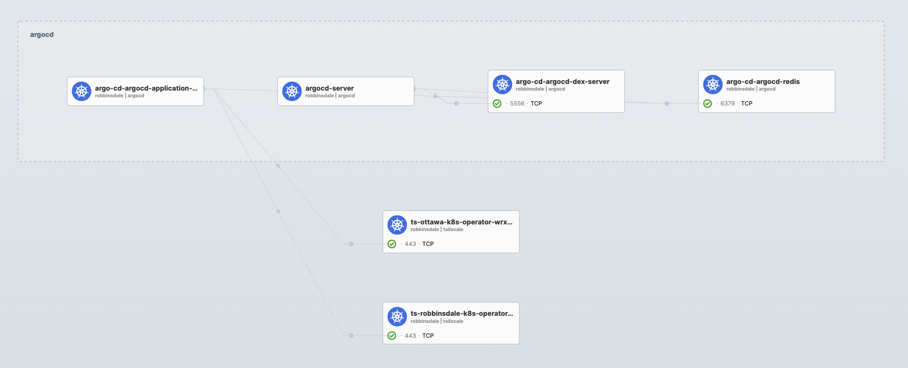

This guide focuses on configuring the Tailscale Kubernetes operator to expose Kubernetes API servers across multiple clusters for ArgoCD multi-cluster management.

## Prerequisites

- Multiple Kubernetes clusters
- Tailscale account with admin access
- Tailscale Kubernetes operator [installed in each cluster](https://tailscale.com/kb/1185/kubernetes/)

## Configuring Operator Hostname and API Server Proxy

When installing the Tailscale operator in each cluster, set these critical parameters:

```bash
helm upgrade --install tailscale-operator tailscale/tailscale-operator \\
  --namespace=tailscale \\
  --create-namespace \\
  --set-string oauth.clientId=<oauth_client_id> \\
  --set-string oauth.clientSecret=<oauth_client_secret> \\
  --set operatorConfig.hostname=cluster1-k8s-operator \\
  --set apiServerProxyConfig.mode=true \\
  --wait
```

Key parameters:
- `operatorConfig.hostname`: Sets a unique hostname for the operator in your tailnet
- `apiServerProxyConfig.mode=true`: Enables Kubernetes API server proxying

Configure each cluster with a unique hostname (e.g., `cluster1-k8s-operator`, `cluster2-k8s-operator`).

## Create Egress Services in ArgoCD Cluster

Apply the following configuration to create egress services in the ArgoCD cluster:

```yaml
apiVersion: v1
kind: Service
metadata:
  name: cluster1-k8s-operator
  annotations:
    tailscale.com/tailnet-fqdn: cluster1-k8s-operator.<TAILNET>.ts.net
spec:
  externalName: placeholder
  type: ExternalName
  ports:
  - name: https
    port: 443
    protocol: TCP
---
apiVersion: v1
kind: Service
metadata:
  name: cluster2-k8s-operator
  annotations:
    tailscale.com/tailnet-fqdn: cluster2-k8s-operator.<TAILNET>.ts.net
spec:
  externalName: placeholder
  type: ExternalName
  ports:
  - name: https
    port: 443
    protocol: TCP
```

Replace `<TAILNET>` with your Tailscale tailnet name.

## Configure Tailscale ACL Grants for Cross-Cluster Access

For egress proxies to communicate with Kubernetes API servers exposed by the Tailscale operators, you need to configure appropriate ACL grants in your Tailscale admin console.

### Why ACL Grants Are Required

Without proper ACL grants:
1. Access to remote Kubernetes API servers will be blocked by Tailscale's access controls
2. Tailscale Egress proxies will be unable to manage resources across clusters
3. Cross-cluster API server communication will fail with authentication errors

### Configuring ACL Grants

Add the following to your Tailscale ACL configuration:

```json
"grants": [
  {
    "src": ["autogroup:admin", "tag:k8s"],
    "dst": ["tag:k8s-operator"],
    "app": {
      "tailscale.com/cap/kubernetes": [
        {
          "impersonate": {
            "groups": ["system:masters"]
          },
          "recorder": ["tag:k8s-recorder"],
          "enforceRecorder": false
        }
      ]
    }
  }
]
```

Key components of this configuration:

- `"src": ["autogroup:admin", "tag:k8s"]` - Specifies who can access the Kubernetes API. Here, it allows admin users and any node tagged with `tag:k8s` (your ArgoCD cluster)
- `"dst": ["tag:k8s-operator"]` - Specifies which Kubernetes operators can be accessed (targets)
- `"impersonate": {"groups": ["system:masters"]}` - Grants administrative access to the Kubernetes API
- `"recorder": ["tag:k8s-recorder"]` - Optional audit logging configuration
- `"enforceRecorder": false` - Makes audit recording optional

This grant enables Tailscale egress proxies (tagged with `tag:k8s`) to communicate with the Kubernetes API servers exposed by the Tailscale operators in your remote clusters.

## Set Up DNS Configuration in ArgoCD Cluster

### Why DNS Configuration is Necessary

DNS configuration is a critical component that enables your ArgoCD cluster to resolve Tailnet domain names. Without this configuration:

1. Your cluster cannot resolve `*.ts.net` domains that Tailscale uses
2. Communication between clusters would fail as hostname resolution would not work
3. ArgoCD would be unable to connect to remote Kubernetes API servers

The Tailscale DNS nameserver provides resolution for all nodes in your Tailnet, enabling seamless cross-cluster communication through Tailscale's private network.

### Implementation

Create a DNSConfig resource in the ArgoCD cluster:

```yaml
apiVersion: tailscale.com/v1alpha1
kind: DNSConfig
metadata:
  name: ts-dns
spec:
  nameserver:
    image:
      repo: tailscale/k8s-nameserver
      tag: unstable
```

Find the nameserver IP:

```bash
kubectl get dnsconfig ts-dns
# Note the NAMESERVERIP (e.g., 10.100.124.196)
```

Update CoreDNS configuration to forward Tailscale domain lookups to the Tailscale nameserver:

```yaml
apiVersion: v1
kind: ConfigMap
metadata:
  name: coredns
  namespace: kube-system
data:
  Corefile: |
    .:53 {
      # ... existing config ...
    }
    ts.net {
      errors
      cache 30
      forward . 10.100.124.196
    }
```

This configuration tells CoreDNS to forward all `ts.net` domain resolution requests to the Tailscale nameserver, allowing pods in your cluster to resolve Tailnet hostnames.

## Access Remote Clusters

Generate the kubeconfig for each cluster:

```bash
tailscale configure kubeconfig cluster1-k8s-operator.<TAILNET>.ts.net
tailscale configure kubeconfig cluster2-k8s-operator.<TAILNET>.ts.net
```

## Add Clusters to ArgoCD

Add the remote clusters to ArgoCD:

```bash
argocd cluster add cluster1-k8s-operator.<TAILNET>.ts.net --grpc-web
argocd cluster add cluster2-k8s-operator.<TAILNET>.ts.net --grpc-web
```

## Visual Confirmation

Once configured, ArgoCD will show the clusters as successfully connected within your Tailnet:


Hubble flows will also demonstrate ArgoCD communicating with the Tailscale egress proxies for each remote cluster:



## References

- [Tailscale Kubernetes Operator Documentation](https://tailscale.com/kb/1185/kubernetes/)
- [Cross-cluster Connectivity Guide](https://tailscale.com/kb/1442/kubernetes-operator-cross-cluster)
- [Cluster Egress Configuration](https://tailscale.com/kb/1438/kubernetes-operator-cluster-egress) 