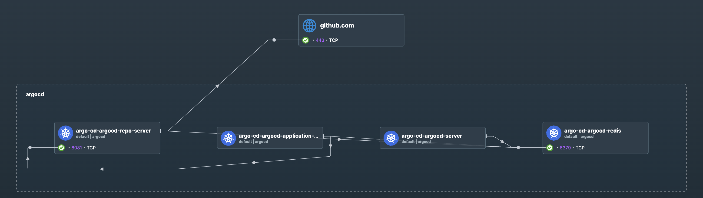
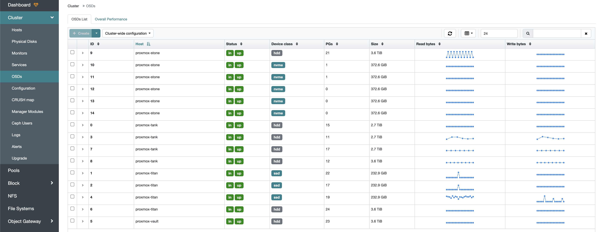
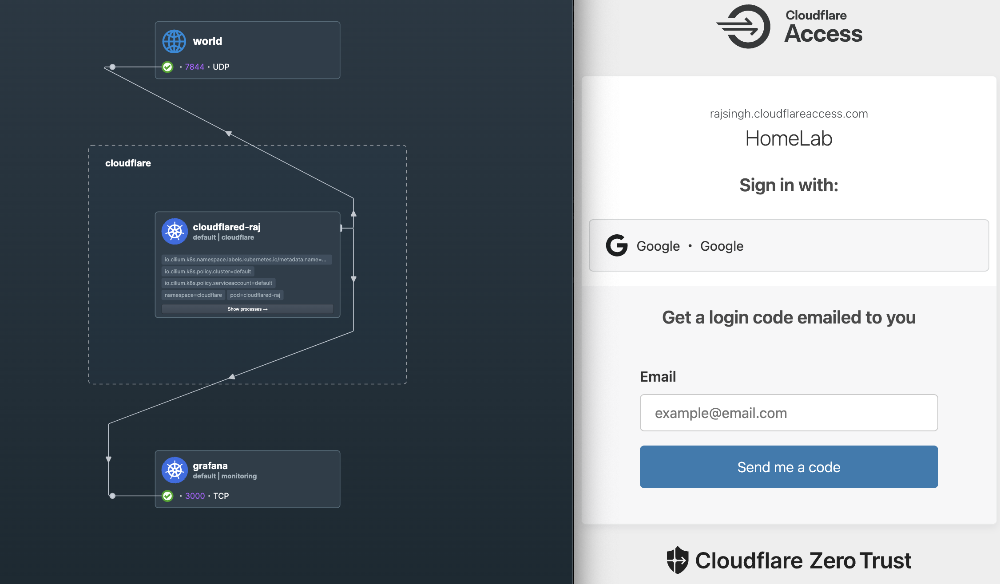
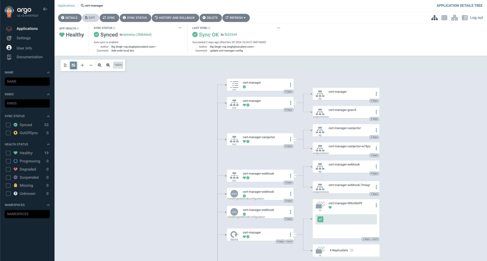
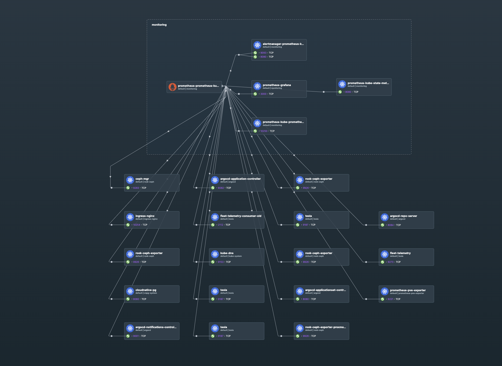
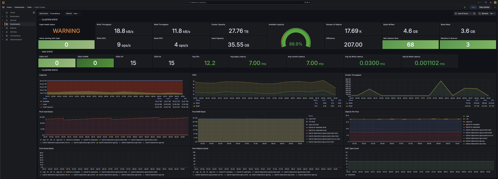
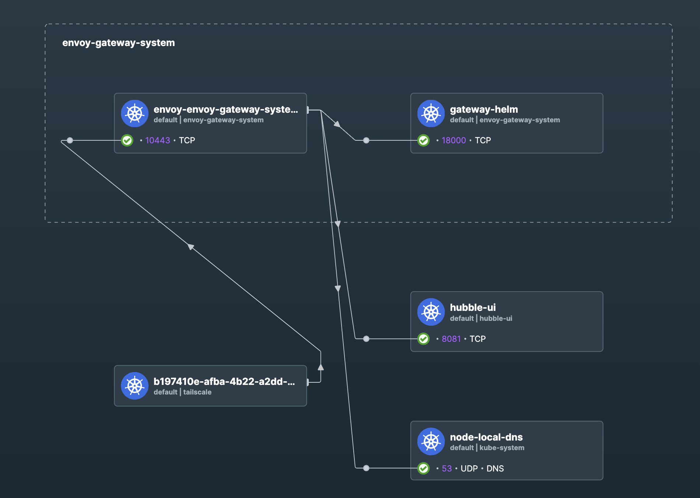
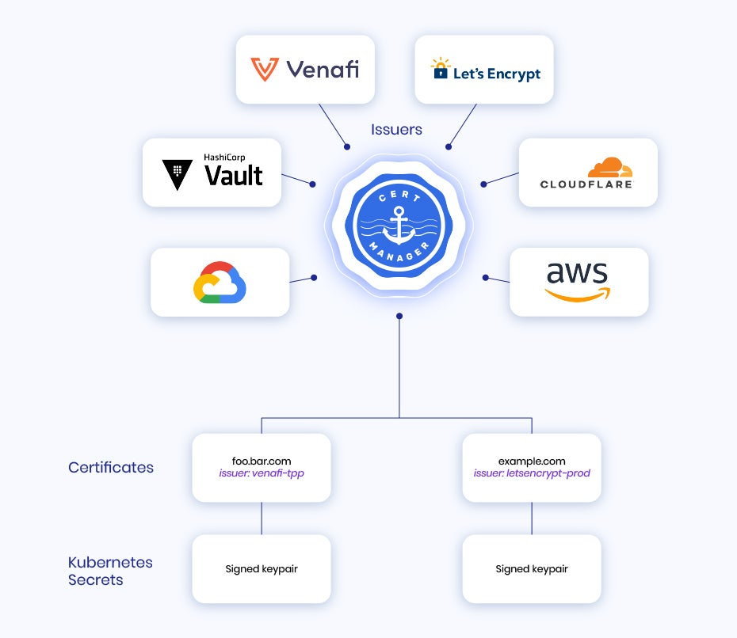

Kubernetes is an amazing tool for standing up production-ready infrastructure both on-premises and in the cloud. Throughout my journey as a Cluster Operator, I have learned many useful practices for managing the world of Kubernetes.

I have always strived to build infrastructure that is secure, resilient, reliable, extensible, and observable. I believe I am at a place where I can lay out a generic framework for managing clusters. This is something I run at home and have had great success with.

Some of the services I run in my cluster include:
- Kafka
- Redis
- Postgres
- s3-compatible object storage
- Tesla Telemetry Injestion (streaming data from my Tesla Model y)
- Home Assistant (automation and monitoring of my home)
- Media Server (Plex, Sonarr, Radarr, etc.)
- [Typeo](https://typeo.io) (Typing practice)
- [Immich](https://immich.app) (Photo backup and sharing)

## Helpful Links
- [Kubernetes Manifests](https://github.com/rajsinghtech/kubernetes-manifests) - My personal GitOps repository of kubernetes manifests.

## Components
- **RKE2** - Lightweight, production-grade Kubernetes distribution, without unnecessary overhead.
- **Cilium** - The most extensible and performant CNI (Container Network Interface) out.
- **Rook/Ceph** - Robust, scalable, and self-healing distributed storage system with seamless integration for block, file, and object storage.
- **Tailscale** - Cutting edge wireguard VPN, used for exposing ingress/egress traffic local to my own SDN (Software Defined Network)
- **Cloudflare** - The best CDN (Contentd Delivery Network) out with a solution called Cloudflared, exposing ingress traffic securly to the cluster.
- **ArgoCD** - Ceclarative GitOps tool for Kubernetes, enabling automated, real-time application deployment and synchronization directly from repositories.
- **Prometheus Stack** - All-in-one monitoring solution for Kubernetes, integrating Prometheus, Grafana, and Alertmanager for robust metrics collection, visualization, and alerting.
- **1Password** - Password manager for all passwords, and secrets.
- **Envoy Gateway** - Next generation ingress controller for Kubernetes, providing advanced routing, load balancing, and security features. Layer 4/7 TCP/UDP traffic.
- **Cert-Manager** - Tool for managing certificates for Kubernetes from a variety of sources.

### Kubernetes Distribution - RKE2
Honestly, there is alot of debate on what the best distribution of kubernetes truly is, in my opinion RKE2 is the best. Use whatever suits your needs.

### CNI - Cilium
The reason for choosing Cilium over other CNIs is simple: it is the superior CNI. Some of the toolsets I use include:
- **BGP** - Local LAN layer 3/4 routing for ingress/egress traffic.
- **Hubble** - A network telemetry, observability, and debugging tool. Essentially Wireshark for Kubernetes—an amazing tool.
- **Network Policy** - Allows for more granular control over traffic, ensuring services do not leak to the public internet or unintended destinations.
- **Local Redirects** - Redirects traffic locally to improve performance. For example, [node-local DNS](https://github.com/kubernetes/kubernetes/blob/master/cluster/addons/dns/nodelocaldns/nodelocaldns.yaml).

#### BGP - Layer 3/4 Routing
BGP is a layer 3/4 routing protocol used to exchange routing information between routers. In the context of Cilium, it facilitates the exchange of routing information between nodes, enabling direct layer 3/4 routing to my local network. You can expose Pod, Service, and LoadBalancer CIDRs to an upstream router.
``` bash
cilium bgp peers
Node            Local AS   Peer AS   Peer Address   Session State   Uptime     Family         Received   Advertised
proxmox-stone   64512      64513     10.0.0.1       established     4h10m42s   ipv4/unicast   107        99    
proxmox-tank    64512      64513     10.0.0.1       established     4h10m44s   ipv4/unicast   107        99    
proxmox-titan   64512      64513     10.0.0.1       established     4h10m44s   ipv4/unicast   107        100   
proxmox-vault   64512      64513     10.0.0.1       established     4h10m41s   ipv4/unicast   107        100  
```

#### Hubble - Network Telemetry
This is a screenshot of Hubble, showing the `argocd` namespace. I can see all the traffic going in and out of the namespace, as well as filter by pod or even a specific port. Nothing beats this for debugging.


#### Network Policy - Granular Control
Cilium can inspect packets, allowing for more granular control over traffic than the default Kubernetes network policy. By intercepting DNS traffic, we can apply policies based on DNS names. For example, I can allow traffic from the public internet to only a few select pods. You can define FQDNs, subsets, and even specific ports.

### Storage - Rook/Ceph
After testing solutions like Longhorn, Rook/Ceph is by far the best storage solution. It offers a much more robust feature set. I can granularly define which Persistent Volume Claims (PVCs) are replicated, snapshotted, the number of replicas, and even the failure domain. The Ceph cluster is fully self-healing and remains resilient even if a drive or node fails.


### VPN - Tailscale
Tailscale is a cutting-edge WireGuard VPN. It is a modern alternative to ZeroTier and offers full compatibility with WireGuard, along with additional features that enhance usability. For example, it includes a built-in DNS proxy and a method to manage WireGuard keys. I run this on all my nodes, allowing me to securely connect to the cluster from anywhere for both ingress and egress traffic. Using Subnet Routing, I can route to pods, services, and local LAN traffic.
  
#### Tailscale Operator
The Tailscale operator is a tool that allows you to manage Tailscale nodes as Kubernetes resources. It provides a way to deploy and manage Tailscale nodes in a Kubernetes cluster, making it easier to integrate Tailscale with other Kubernetes resources and services.
``` yaml
apiVersion: tailscale.com/v1alpha1
kind: Connector
metadata:
  name: robbinsdale-connector-0
spec:
  hostname: robbinsdale-connector-0
  subnetRouter:
    advertiseRoutes:
      - "10.43.0.0/16" # Service CIDR
      - "10.42.0.0/16" # Pod CIDR
      - "10.96.0.0/16" # LoadBalancer Service CIDR
      - "192.168.1.0/24" # LAN CIDR
  exitNode: true
```

### CDN - Cloudflare
Cloudflare offers a product called **Cloudflared**, which is a tunneling proxy for securely connecting to the internet. It serves as a modern alternative to Ngrok and is fully compatible with WireGuard. I can add authentication to my ingress traffic and securely connect to my cluster from the public internet.


### GitOps - ArgoCD
After using GitOps tools like Flux, I have found ArgoCD to be the best. It boasts a very clean UI and is exceptionally user-friendly. By employing a technique of deploying Helm charts using Kustomize, I keep my Git repository clean while maintaining a robust method to deploy my infrastructure.

Below is an example of a Kustomize file that deploys the cert-manager Helm chart.
``` yaml
apiVersion: kustomize.config.k8s.io/v1beta1
kind: Kustomization
resources:
  - cluster-issuer.yaml
  - secret.yaml
helmCharts:
  - name: cert-manager
    repo: https://charts.jetstack.io/
    version: 1.16.1
    namespace: cert-manager
    releaseName: cert-manager
    includeCRDs: true
    valuesFile: values.yaml
```


### Monitoring - Prometheus Stack
The Prometheus stack is a collection of tools for monitoring and observability. It includes Prometheus, Grafana, and Alertmanager. I can monitor my cluster metrics, logs, and alert on critical events. In addition, I can capture metrics from any of my workloads running in the cluster.



### Secrets Management - 1Password
1Password is a password manager that I can use to store all my passwords and secrets. It is a secure and easy-to-use tool that I can use to manage my secrets.
```yaml
apiVersion: onepassword.com/v1
kind: OnePasswordItem
metadata:
  name: cloudflare-raj
  namespace: cert-manager
spec:
  itemPath: "vaults/K8s/items/Cloudflare - Raj"
```

### Ingress/Gateway - Envoy Gateway
Envoy Gateway is a modern ingress controller for Kubernetes that provides advanced routing, load balancing, and security features. It is fully compatible with Envoy Proxy, providing a robust and flexible ingress solution. This is a Layer 4/7 TCP/UDP ingress controller. 

This solution does not use the Kubernetes Ingress resource, but instead uses a custom resource definition called `HTTPRouteGroup` and `Listener`. These are part of the [Gateway API spec](https://gateway-api.sigs.k8s.io/), which is a powerful new way to manage ingress traffic in Kubernetes. The advantage here is I can manipulate traffic at the TCP/UDP level, and not just HTTP/HTTPS.



### Certificate Management - Cert-Manager
Cert-Manager is a tool for managing certificates for Kubernetes from a variety of sources. It provides a way to deploy and manage certificates in a Kubernetes cluster, making it easier to integrate certificates with other Kubernetes resources and services. These certificates can be used for a variety of purposes, such as securing ingress traffic, or for workloads that need to authenticate to other services. The great thing about cert-manager is it can automatically renew certificates that are close to expiration, and it can also issue certificates for DNS names.
