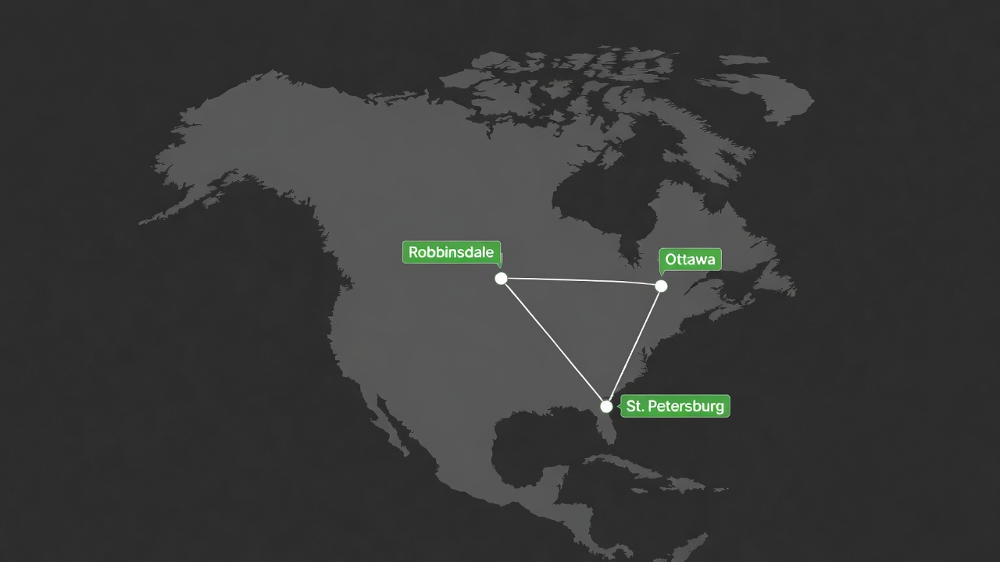
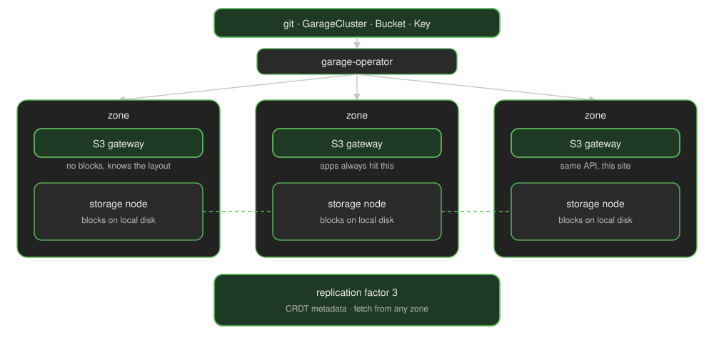
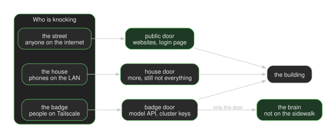
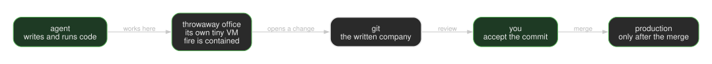

A couple years ago I wrote about my [homelab cluster framework](/p/cluster-framework/). That was how I ran Kubernetes at home: distribution, CNI, storage, GitOps, the usual tour. I still run the same kind of thing. The question that actually eats my time now is simpler and worse: **where does this work belong.**

A coding agent opening a pull request, a model answering a prompt, Postgres keeping WAL, and Home Assistant watching the house are not the same job. I used to pile them onto one cluster because that is what a homelab does. It got crowded, and the blast radius got stupid. So I split the work across three sites and I treat that split as the control plane. Not a fancy scheduler. A rule I can point at: this kind of work runs here, that kind of work runs there, and git is how I say so.

I am calling this an **AI CDN** as a shorthand, not as a claim that I reinvented Cloudflare. A CDN puts a cached object near the person who asked for it. I do not have a fleet of equivalent edges serving the same model. I have one GPU site, one place the company gets written, and one house. The useful overlap is the other half of a CDN: an origin that already exists in more than one city, and a door policy for who may ask. That is what I actually built. The name is the analogy. The rest of this post is the mapping, and where it stops.

I run this myself. When I say "we" later, I mean the garage-operator project I maintain, not a staffed company.

The wiring lives in [the manifests](https://github.com/keiretsu-labs/kubernetes-manifests).

## Where work goes today

**Ottawa** is where I change the system. Git, login, dashboards, agent workspaces. If Ottawa is down, Robbinsdale and St. Petersburg keep their running pods. I cannot ship a change, and I cannot log in from the usual front door. That is an observed shape, not a slogan: headquarters is the writer, not the only survivor.

**Robbinsdale** is the house. Home Assistant, media, a second copy of family files. I do not put coding agents there. The house is not a factory, and I do not want an agent session on the same site as the cameras.

**St. Petersburg** is where the GPUs are. Two machines, one model serving process. Ottawa applications reach that process over the site-to-site network, pod to pod. I do not send model traffic out to the public internet, and I do not send it through Tailscale. Git does not live here on purpose. A GPU site that is also headquarters is one afternoon away from being both dumb and unreachable.

How a workload lands on a site today is not magic. I put a pointer file in that site's tree and merge it. No pointer, it does not deploy there. I have not built anything that picks a site for an agent at runtime. If I say "scheduling control plane," I mean that placement rule plus the network that makes the placement reachable. The next thing I want — "this agent session should run in St. Petersburg because the model is there" — does not exist yet.

## How the three sites talk

Each site has a UniFi gateway. The three gateways are meshed, so the LANs can reach each other. Cilium is the CNI. It BGP-peers with the *local* UniFi gateway and advertises the cluster's pod, service, and load-balancer addresses onto that LAN. ClusterMesh is how a service in Ottawa finds backends in St. Petersburg. That is the hallway: Ottawa asking the model, Garage replicating objects, CI borrowing capacity. It is ordinary L3, not a VPN hop.

Tailscale is how *I* get in. Laptops, phones, `kubectl`. I used to run cross-cluster traffic on Tailscale too. [I wrote that up](/p/tailscale-operator/). With three sites and a working UniFi mesh, it was the slower path for the work, so I stopped using it as the backbone. People still badge in that way. Cluster-to-cluster work does not.

Those two paths are easy to mix up, so here they are in one place. **Applications** in Ottawa talk to the model over ClusterMesh. **I** reach the model API from a laptop on the tailnet. The public internet gets a settings UI behind login, not the model endpoint.

Also: a ClusterIP on this network is not private just because Kubernetes called it internal. BGP puts it on the LAN. The Tailscale subnet router can put the same ranges on the tailnet. If I need a lock, I put it on the Gateway or in policy, not in the service type.

## The origin I actually needed

Garage is the object store. I wanted buckets, access keys, and nodes to be files in git, federated across the three sites, with a gateway that keeps its identity when a pod restarts. Upstream Garage is a binary and a layout you edit by hand. That is fine for one box. It is a bad interface for Flux and for agents that open pull requests.

So I wrote [garage-operator](https://github.com/rajsinghtech/garage-operator). One `GarageCluster` per site, zone named after the city, replication factor 3. Applications talk to a local gateway, not to a disk. If the local disks are gone but the network is up, the gateway can still read from another site. That is a different failure than "the whole city disappeared," and I am not going to pretend I have exercised every combination in anger. I have exercised the operator enough to keep running it.

Rook-Ceph is still the block layer in Ottawa and Robbinsdale. Garage did not replace it. Ceph is disks for databases and PVCs. Garage is S3 for WAL, images, snapshots, and anything else that should exist in more than one city.

Git holds the declarations: the cluster CR, the bucket, the key. The bytes live in Garage. If I write "if it is not in git, it does not last," I mean the *shape* of the system. The data has a different home.

## Who is allowed to ask

Every site has three doors: public internet, house LAN, tailnet. Names that only have a backend in Ottawa stay pinned to Ottawa. I have burned time on "global" names that 404 half the time because the other WAN edge has nothing behind them.

The model is the one I care about. The management UI can sit on a public name, behind login. The inference API does not. St. Petersburg is where that work was placed. The internet does not get a seat in that room.

DNS is how a person finds a door. BGP is how a packet finds a backend once it is on the fabric. I pick both of those by hand in git. I do not yet pick an environment for an agent the same way.

## A session, not a laptop

Here is the path I actually use. An agent session starts in Ottawa, in a Kata VM — its own kernel, thrown away when the session ends. Most sessions cannot join the tailnet. A separate runtime is the only one that gets a TUN, and I treat that as a real permission, not a convenience. The agent can install junk, clone the repo, and open a pull request. Local checks render all three sites before I merge. Flux is the only writer to the clusters. The session can make a mess of its VM. It does not apply YAML to production.

That is a narrower guarantee than "the company only changes when I merge." Production GitOps changes when I merge. A session that was granted tailnet access can still reach whatever that identity can reach *before* a merge. I try not to grant that.

[Pillar's Week of Sandbox Escapes](https://www.pillar.security/blog/the-week-of-sandbox-escapes) (July 2026) is the reason I care about the handshake. Cursor, Codex, and Gemini CLI did not need to break the box. The agent wrote a file — a hook, a git config, a Docker socket — and something trusted on the host ran it later. I do not want my laptop to be that host, and I do not want Flux to be an implicit `eval` of whatever the agent left on disk. Review the diff. Then merge.

Postgres is the same split as everything else. The cluster definition is in git. WAL and base backups go to Garage. A PVC is not backed up because a cronjob is green. It is backed up when I have restored it onto a new volume and the thing came back. I have been burned by the other kind of backup.

You can rent a coding agent, a GPU, and a sandbox. I do. I also run my own, because I wanted the placement rule, the doors, and the origin to be mine. garage-operator is the piece I could not rent in a shape I would merge.

The [manifests](https://github.com/keiretsu-labs/kubernetes-manifests) are the wiring. This is what the 2024 lab turned into once "where does this run" stopped being obvious.
