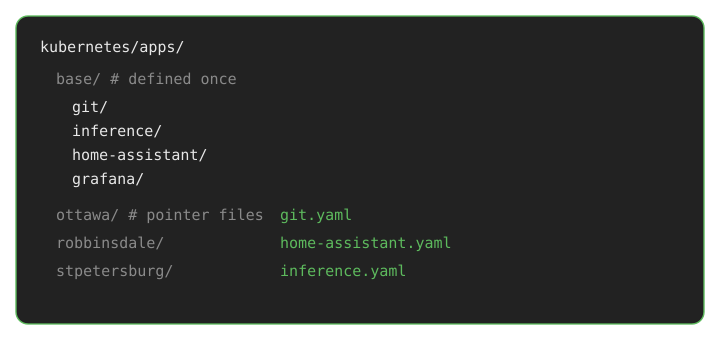
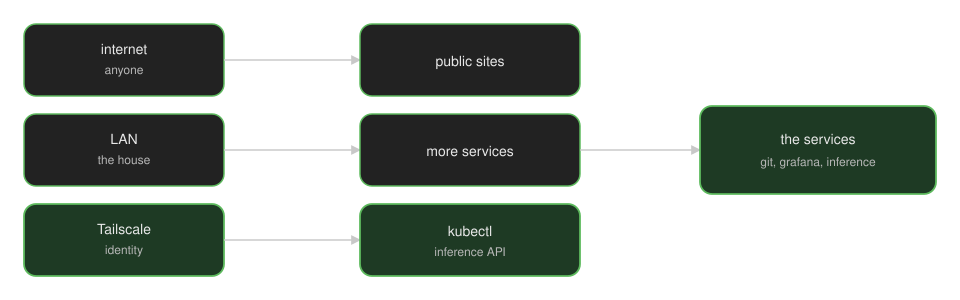

A couple years ago I wrote about my [homelab cluster framework](/p/cluster-framework/). How I ran Kubernetes at home. This is the next version: several sites as one system, hardware that does not match, and agents that can move a service from one site to another by opening a pull request.

That last part is the reason this exists. An agent reads the repo, changes a pointer, and Flux stands the same app up on a different house. We still merge. The synthesis is what used to take a weekend of "rebuild it over there."

We call it a [keiretsu](https://en.wikipedia.org/wiki/Keiretsu) because that is the closest word for independent sites that stay separate and still operate as a group. They trade with each other first. They share a warehouse. Git is how the group agrees. If it is not in the repo, it did not happen.

Ours is three houses. Kartik, Luke, and me. Homes, with the same services replicated so a bad day at one of them is not the whole group.

The wiring lives in [the manifests](https://github.com/keiretsu-labs/kubernetes-manifests).

## Placement is a folder

The app is defined once, under `base/`. Each site is a folder of pointer files. If `git.yaml` is in a site folder, git runs there. If it is not, it does not. Moving infrastructure is moving a file. Agents are good at that. That is the power.

Hardware still matters. Inference needs GPUs. Home automation needs the cameras that are already in that house. Block storage is whatever the site has, [Ceph](https://rook.io/) or local disks, a storage class, not a religion. Everything else is a service we chose to run: git, CI, Grafana, Garage, agent workspaces, inference.

## Services

Not a tour of whose basement. The group runs:

- **Git and CI**, and the workspaces agents sit in
- **Inference**, a serving process on GPU machines
- **Home automation**
- **One Grafana**, fed by every site
- **Garage**, the object warehouse
- **Tailscale**, identity for people

Agents and inference are two services. The agent opens a pull request. Inference answers. Putting both on the same box because "we do AI" is a bad placement, not a strategy.

## How the sites talk

Each house has a [UniFi](https://www.ui.com/) gateway. Those gateways are meshed. That is the underlay.

[Cilium](https://cilium.io/) is the [CNI](https://kubernetes.io/docs/concepts/extend-kubernetes/compute-storage-net/network-plugins/). It gives pods IPs and speaks [BGP](https://www.cloudflare.com/learning/security/glossary/what-is-bgp/) to the local UniFi box so the router learns those addresses. I wrote the [one-site version](/p/cilium-unifi/) years ago.

[ClusterMesh](https://docs.cilium.io/en/stable/network/clustermesh/intro/) is how a Service on one site reaches a backend on another. A pod uses a DNS name. The packet goes across the mesh. Garage, CI, metrics, logs, inference calls: same path.

[Tailscale](https://tailscale.com/) is identity. Laptops, phones, [`kubectl`](https://kubernetes.io/docs/reference/kubectl/). I used to send cluster traffic over it too ([writeup](/p/tailscale-operator/)). The clusters use the UniFi mesh now. People still prove who they are on the tailnet.

A [ClusterIP](https://kubernetes.io/docs/concepts/services-networking/service/#publishing-services-service-types) is on the LAN because BGP put it there. Internal is not a lock. A [Gateway](https://gateway-api.sigs.k8s.io/) or a policy is.

## One Grafana

Every site scrapes itself. [Prometheus](https://prometheus.io/) stamps a `cluster` label and remote-writes into [Mimir](https://grafana.com/oss/mimir/). Logs take the same path into [VictoriaLogs](https://docs.victoriametrics.com/victorialogs/). There is one [Grafana](https://grafana.com/oss/grafana/). Three sites, one pane. That is the whole construct.

## Garage

[Garage](https://garagehq.deuxfleurs.fr/) is S3 built for several buildings. Deuxfleurs designed it that way: [zones](https://garagehq.deuxfleurs.fr/documentation/reference-manual/configuration/), a [layout](https://garagehq.deuxfleurs.fr/documentation/cookbook/real-world/), [gateway nodes](https://garagehq.deuxfleurs.fr/documentation/cookbook/gateways/) that speak S3 and do not have to store blocks, storage nodes that do. Metadata is a CRDT. Replication factor is a number you pick. An app always talks to the gateway on *this* site. The gateway already knows who holds the blocks. If local disks are unhappy, it fetches from another zone.

That is the architecture. Ours is three zones, factor 3, mixed disks. Nothing about it requires the houses to match.

What we added is git. Upstream Garage is a binary and a layout you edit by hand. Fine for one box. A bad fit for Flux and for agents that open pull requests. I wrote [garage-operator](https://github.com/rajsinghtech/garage-operator) so a cluster, a bucket, and a key are merges. I still maintain it. After that, Garage is ordinary: same git, same Flux, same mesh.

## Who can call what

Three ways in: the internet, the LAN, Tailscale identity. Public sites on the internet. More services on the LAN. `kubectl` and the inference API on Tailscale. Inference is not a public prompt box.

## Agents

An agent session is a [Kata](https://katacontainers.io/) VM. Own kernel. Thrown away when it ends. It clones the repo and opens a pull request. That is how infrastructure moves: the agent edits a pointer, checks render, we merge, Flux applies. The VM can catch fire. It does not apply production.

[Pillar](https://www.pillar.security/blog/the-week-of-sandbox-escapes) showed last July that Cursor, Codex, and Gemini CLI did not need to break out. They wrote a hook or talked to Docker, and the host ran it. Review, then merge.

Postgres is a file in git. WAL goes to Garage. A volume backup is real when it has been restored onto a new disk.

I rent coding agents when I need them. This stack is what lets those agents move our infrastructure instead of chatting about it.

The [manifests](https://github.com/keiretsu-labs/kubernetes-manifests) are the wiring.
