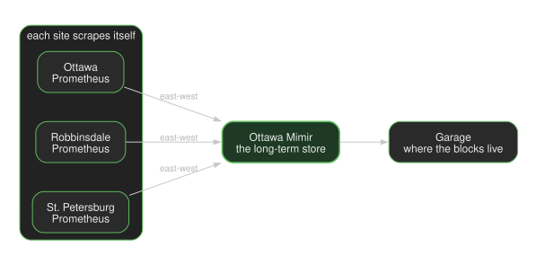

A couple years ago I wrote about my [homelab cluster framework](/p/cluster-framework/). That was how I ran Kubernetes at home: distribution, CNI, storage, GitOps, the usual tour. I still run the same kind of thing. The question that actually eats my time now is simpler and worse: **where does this work belong.**

A coding agent opening a pull request, a model answering a prompt, Postgres keeping WAL, and Home Assistant watching the house are not the same job. I used to pile them onto one cluster because that is what a homelab does. It got crowded, and the blast radius got stupid. So I split the work across three sites and I treat that split as the control plane. Not a fancy scheduler. A rule I can point at: this kind of work runs here, that kind of work runs there, and git is how I say so.

The right name for that is not a CDN. I do not have a dozen equivalent edges caching the same object. I have three houses that share an origin, a network, and a set of doors, and they are deliberately *not* copies of each other. Mine, Karthik's, and Luke's. That is a **keiretsu** in the only sense I mean it: affiliated, separate on purpose, still one thing. Ottawa writes. Robbinsdale keeps the house. St. Petersburg thinks. Garage is the warehouse we all use.

When I say "we" later I usually mean the garage-operator project I maintain. Sometimes I mean the three of us, because the hardware lives in our living rooms, not in a colo with a badge reader.

The wiring lives in [the manifests](https://github.com/keiretsu-labs/kubernetes-manifests).

## Where work goes today

**Ottawa** is my house, and it is where I change the system. Git, login, dashboards, agent workspaces. If Ottawa is down, Robbinsdale and St. Petersburg keep their running pods. I cannot ship a change, and I cannot log in from the usual front door. Headquarters is the writer, not the only survivor.

**Robbinsdale** is Luke's house. Home Assistant, media, a second copy of family files. I do not put coding agents there. That is someone else's home, and I do not want an agent session on the same site as the cameras.

**St. Petersburg** is Karthik's, and it is where the GPUs are. Two machines, one model serving process. Ottawa applications reach that process over the site-to-site network, pod to pod. I do not send model traffic out to the public internet, and I do not send it through Tailscale. Git does not live here on purpose. A GPU site that is also headquarters is one afternoon away from being both dumb and unreachable.

How a workload lands on a site today is not magic. I put a pointer file in that site's tree and merge it. No pointer, it does not deploy there. I have not built anything that picks a site for an agent at runtime. If I say "scheduling control plane," I mean that placement rule plus the network that makes the placement reachable. The next thing I want — "this agent session should run in St. Petersburg because the model is there" — does not exist yet.

## How the three sites talk

Start with the houses. Each one has a [UniFi](https://www.ui.com/) gateway — the box that is the router for that LAN. Those three gateways are meshed, so a packet from my living room can reach a packet from Luke's or Karthik's without going out to the public internet. That is the underlay. Everything else sits on it.

On top of that, each house runs Kubernetes. [Cilium](https://cilium.io/) is the [CNI](https://kubernetes.io/docs/concepts/extend-kubernetes/compute-storage-net/network-plugins/): the thing that gives every pod an IP and decides how those IPs route. Cilium speaks [BGP](https://www.cloudflare.com/learning/security/glossary/what-is-bgp/) to the *local* UniFi gateway — I wrote the [one-cluster version of that](/p/cilium-unifi/) when this was still a homelab. In practice: the router learns "these pod and service addresses live behind me." Do that at all three houses, and the mesh already knows how to forward.

[ClusterMesh](https://docs.cilium.io/en/stable/network/clustermesh/intro/) is the last hop of that idea. It is how a Service in Ottawa can have backends in St. Petersburg. No extra proxy. A pod here calls a DNS name, and the packet goes to Karthik's house the same way it would go to another pod in Ottawa. That is what I mean by the hallway. Garage replication uses it. CI borrowing a machine at Luke's uses it. Prometheus remote-write uses it.

[Tailscale](https://tailscale.com/) is not that hallway. Tailscale is how *I* get in: laptop, phone, [`kubectl`](https://kubernetes.io/docs/reference/kubectl/). I used to send cluster-to-cluster traffic over Tailscale too. [I wrote that up](/p/tailscale-operator/). Once the UniFi mesh was solid, it was the slower path for the work, so I stopped using it as the backbone. People still join that way. Workloads do not.

The language-model path is the one that confuses people, so here it is without the poetry. The GPUs and the serving process live at Karthik's. Something running in Ottawa — a workspace, an app, a proxy — calls that process like it was in the next namespace, over ClusterMesh. When I debug from a coffee shop, *I* am not that pod. I hit the API over Tailscale. The public internet is a third caller: it can see a settings page behind login. It cannot send a prompt into the model. Three callers, three doors, one GPU box.

One more thing LinkedIn-Kubernetes will get wrong. A [ClusterIP](https://kubernetes.io/docs/concepts/services-networking/service/#publishing-services-service-types) is not private just because the docs say internal. BGP puts that address on the LAN. A Tailscale [subnet router](https://tailscale.com/kb/1019/subnets) can put the same ranges on the tailnet. If I need a lock, I put it on a [Gateway](https://gateway-api.sigs.k8s.io/) or in policy, not in the Service type.

## Watching the other two cities

Split the work and you immediately have a second problem: you cannot SSH around hoping to notice. Each site runs [Prometheus](https://prometheus.io/) as a forwarder. It scrapes what is local, stamps a `cluster` label so the three cities do not smear into one timeseries, and remote-writes east-west into [Mimir](https://grafana.com/oss/mimir/) in Ottawa. Mimir is the long-term store. The blocks land in Garage. [Grafana](https://grafana.com/oss/grafana/) in Ottawa is where I actually look; the other two sites do not get their own dashboard island.

That path is the same hallway as the model. Robbinsdale does not Tailscale its metrics to me. St. Petersburg does not dump GPU stats onto the public internet. If Ottawa is down I lose the long view. Local Prometheus still has a short window, which is enough to see that the house is on fire and not enough to ask what last Tuesday looked like. I picked that. Putting a Mimir in every city would mean three warehouses for numbers I already replicate as objects.

Logs follow the same gravity. They are collected everywhere and stored in Ottawa. Metrics, logs, WAL, snapshots: if it has to survive a site, it goes through the warehouse. If it is only useful where it happened, it stays there.

## The warehouse

[Garage](https://garagehq.deuxfleurs.fr/) is S3 for several buildings, not one data center. Deuxfleurs built it so a co-op could keep objects in more than one place without pretending they had a SAN. Zones, replication factor, a gateway in front of local disks. That is already the keiretsu: three houses, copies of the bytes, nobody talking to a disk in another city on the hot path.

The thinking is almost boring once you see it. An app in Ottawa speaks S3 to a gateway in Ottawa. That gateway reads and writes local disks when it can, and the cluster copies blocks to Luke's and Karthik's in the background until there are three. If Ottawa's disks are unhappy but the hallway is up, the same gateway can still fetch a copy from another house. That is a different failure than "the city vanished." I have not dramatized every combination. I have run it long enough to keep it.

What was *not* boring was operations. Upstream Garage is a binary and a layout file you edit by hand. Fine for one box. A bad interface for [Flux](https://fluxcd.io/) and for agents that open pull requests. I wanted a bucket to be a merge, a key to be a merge, a node to be a merge. So I wrote [garage-operator](https://github.com/rajsinghtech/garage-operator). `GarageCluster`, `GarageBucket`, `GarageKey`. One cluster CR per house, zone named after the city, replication factor 3. We still maintain it because this estate is the reason it exists.

After that, Garage is the most trivial service in the keiretsu. It uses the same hallway as the model and the metrics. Apps already speak S3. Git already holds the CR. Flux already applies it. There is no extra VPN, no AWS account, no special network just for objects. The operator is the only new piece, and the point of the operator was to make the rest look like everything else.

[Rook-Ceph](https://rook.io/) is still the block layer in Ottawa and Robbinsdale. Garage did not replace it. Ceph is disks for databases and volumes. Garage is objects: Postgres WAL, container images, Mimir blocks, volume snapshots, anything the three houses should still have if one of us has a bad day. Git is the shape. Garage is the bytes.

## Who is allowed to ask

Every site has three doors: public internet, house LAN, tailnet. Names that only have a backend in Ottawa stay pinned to Ottawa. I have burned time on "global" names that 404 half the time because the other WAN edge has nothing behind them.

The model is the one I care about. The management UI can sit on a public name, behind login. The inference API does not. St. Petersburg is where that work was placed. The internet does not get a seat in that room.

DNS is how a person finds a door. BGP is how a packet finds a backend once it is on the fabric. I pick both of those by hand in git. I do not yet pick an environment for an agent the same way.

## A session, not a laptop

Here is the path I actually use. An agent session starts in Ottawa, in a Kata VM — its own kernel, thrown away when the session ends. Most sessions cannot join the tailnet. A separate runtime is the only one that gets a TUN, and I treat that as a real permission, not a convenience. The agent can install junk, clone the repo, and open a pull request. Local checks render all three sites before I merge. Flux is the only writer to the clusters. The session can make a mess of its VM. It does not apply YAML to production.

That is a narrower guarantee than "the company only changes when I merge." Production GitOps changes when I merge. A session that was granted tailnet access can still reach whatever that identity can reach *before* a merge. I try not to grant that.

[Pillar's Week of Sandbox Escapes](https://www.pillar.security/blog/the-week-of-sandbox-escapes) (July 2026) is the reason I care about the handshake. Cursor, Codex, and Gemini CLI did not need to break the box. The agent wrote a file — a hook, a git config, a Docker socket — and something trusted on the host ran it later. I do not want my laptop to be that host, and I do not want Flux to be an implicit `eval` of whatever the agent left on disk. Review the diff. Then merge.

Postgres is the same split as everything else. The cluster definition is in git. WAL and base backups go to Garage. A PVC is not backed up because a cronjob is green. It is backed up when I have restored it onto a new volume and the thing came back. I have been burned by the other kind of backup.

You can rent a coding agent, a GPU, and a sandbox. I do. I also run my own, because I wanted the placement rule, the doors, and the warehouse to be mine. garage-operator is the piece I could not rent in a shape I would merge.

The [manifests](https://github.com/keiretsu-labs/kubernetes-manifests) are the wiring. This is what the 2024 lab turned into once "where does this run" stopped being obvious.
