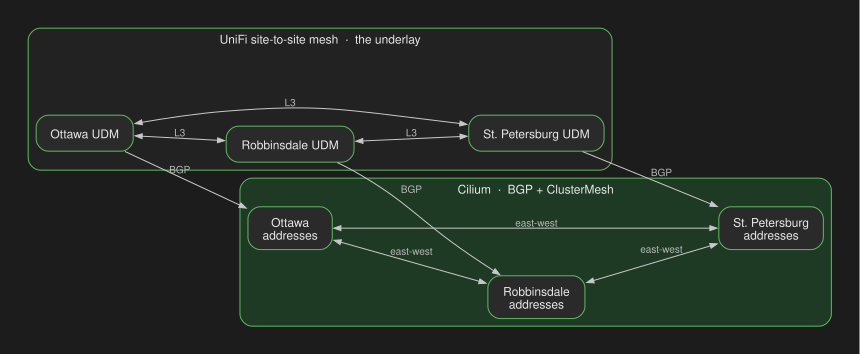
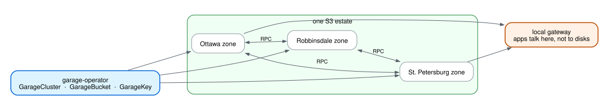
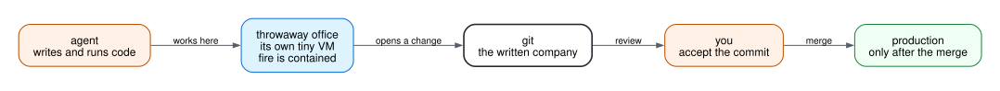

A couple years ago I wrote about my [homelab cluster framework](/p/cluster-framework/). RKE2, Argo CD, Tailscale as the way clusters talked. That post was a lab.

This is the same machines, grown up. Git is the source of truth. Flux ships it. UniFi is the WAN. Cilium is east-west. Agents write a lot of the diffs. I still merge. I call the shape an **AI CDN** because the job is the same as a CDN: put the right thing at the right edge, behind the right door. The thing used to be a file. Now it is a model, a commit, or an agent session that is allowed to open a pull request.

You do not get that without an origin that already lives in more than one city. I did not find an operator that made Garage a GitOps object across three Kubernetes clusters, so I [wrote one](https://github.com/rajsinghtech/garage-operator). We still maintain it. That is the object store this whole thing sits on.

Live manifests: [keiretsu-labs/kubernetes-manifests](https://github.com/keiretsu-labs/kubernetes-manifests).

## Three sites

They are departments, not replicas.

**Ottawa** is headquarters. Git, login, Grafana, the workspace control plane, the registry. If Ottawa is down the other two keep their pods. You just cannot log in, ship, or see.

**Robbinsdale** is the house. Home Assistant, media, a second Ceph, a second Garage zone.

**St. Petersburg** is inference. Two GB10 Sparks, one vLLM group. Ottawa talks to that model over Cilium, not Tailscale.

## The fabric

Each site has a UniFi gateway. The three UDMs are meshed. That is the WAN. Cilium does not create the path. Cilium *uses* it.

Cilium is the CNI, kube-proxy off, BGP into the local UDM. It advertises pod, ClusterIP, and LoadBalancer addresses. ClusterMesh is how Ottawa calls the model in St. Petersburg by service name. Inference, Garage RPC, CI agents, metrics, logs all ride that hallway. Hubble is Wireshark for it.

Cilium peers with the **local** router only. The mesh already moves packets between sites. A second BGP session to the other UDMs does not add a path. ClusterMesh is services. BGP is "tell my router about this cluster."

Tailscale is the badge, not the road. The operator's API proxy is how `kubectl` works. The kubeconfig in git has no real credentials. Grants are the org chart, and they have tests. I use Tailscale for laptops, phones, cluster API, and a workspace that needs to join the tailnet from *inside* its sandbox. I do not use it as the path between Ottawa and St. Petersburg. Most Kubernetes-plus-Tailscale writeups, including [my own](/p/tailscale-operator/), treat Tailscale as the interconnect. For three sites that is the slow way.

"It is only a ClusterIP" is not a lock. BGP puts those addresses on the LAN, and the subnet router puts them on the tailnet. Use a Gateway policy, a Cilium policy, or a grant.

## The origin

A CDN without a multi-city origin is a website with extra YAML. Garage is that origin. **garage-operator** is how it gets there.

Off the shelf, Garage is a binary and a layout you edit by hand. That does not survive three clusters, Flux, and agents that open pull requests. So I wrote [garage-operator](https://github.com/rajsinghtech/garage-operator): `GarageCluster`, `GarageNode`, `GarageBucket`, `GarageKey`. Flux owns those objects. We still maintain the operator because this estate is the reason it exists — multi-cluster federation, node-local disks, a gateway tier that keeps its identity, buckets as CRs.

One cluster CR per site. Together they are one S3 estate, replication 3. One site down is fine. Two is an outage of the object store. RPC rides ClusterMesh, same hallway as the model. Apps never talk to a disk. They talk to the **local gateway**. Signatures verify on-site. If local storage is gone, the gateway still reads from a surviving zone.

Postgres WAL, OCI blobs, volume snapshots, agent artifacts — that is what the factory actually stores.

## Three doors

A homelab that only exists on a VPN is a clubhouse. This has a street.

Every cluster gets the same three Gateways:

1. **`public`** — internet. Cloudflare, Let's Encrypt, k8gb for names that actually run in more than one place. Names that only exist in Ottawa stay pinned there. GSLB with no backend is a coin flip.
2. **`private`** — the LAN. Same certs, fewer listeners.
3. **`ts`** — tailnet. Cluster control and the model API.

The model *settings* page can be public, behind login. The model *API* is not. Path and hostname both have to be wrong for a prompt to hit the internet. The door is the Gateway, not the subnet.

North-south is DNS, then Gateway, then maybe a cross-cluster service. East-west skips DNS and goes ClusterMesh. Mixing those up is how you get a 404 that looks like a network outage, or a network outage that looks like a cert problem.

Steer the client with DNS. Steer the packet with BGP. The thing I have not built yet is treating "which cluster should this agent run on" as the same kind of decision. The model already works that way: brain in St. Petersburg, front door in Ottawa, ClusterMesh in between.

## Agents

Coding agents execute whatever they just wrote. Default containers share the host kernel. Fine for Flux. Not fine for a workspace.

Every user session is Kata: a small VM, its own kernel. Trash the room, the room dies. A separate RuntimeClass is the only one allowed to open a TUN and run Tailscale inside the sandbox. If every sandbox is a VPN node, you did not sandbox anything. Locks go on the thing being protected. Once traffic is on Tailscale, source policy cannot always see the final destination.

This summer, Cursor, Codex, and Gemini CLI did not need to break out. The agent wrote a file and a trusted program on the laptop ran it later. The hole was the handshake. Mine is a merge. The agent can wreck its VM. Production changes when I accept a commit.

The factory around that: a pointer file means an app is deployed. No pointer, not deployed. Agents read the repo. Local gates render all three clusters. GitHub Actions does it again. Merge to `main`. Flux is the only writer. I used to run Argo CD. I am not trying to fire myself. I am trying to make the floor small enough that I can still walk it.

## Databases and disks

Postgres is CloudNativePG. A cluster CR per database. WAL and base backups go to Garage — that is why the operator exists. Restore is from object storage, not a tarball on a laptop.

YAML in git is not a backup of a PVC. Kopiur snapshots the volume, keeps it in Garage, restores into a **new** PVC. A schedule that never produced a snapshot is not a backup. A restore you have not run is not a restore. Ottawa and Robbinsdale snapshot Ceph. St. Petersburg is mostly local-path; Home Assistant is the one that has to work.

Rook-Ceph is block at Ottawa and Robbinsdale. A Spark dying is data loss for anything that only lived there and was not snapshotted.

## What breaks

**Ottawa down:** auth, git, CI, Grafana. Other sites keep running. You cannot see them or ship.

**St. Petersburg down:** local inference dies. The factory still merges. Clients fail over through the front door.

**Robbinsdale down:** the house and one Garage/Ceph zone. Ottawa still answers.

I picked those numbers. If you rent the factory, the sandbox, or the GPUs, someone else did.

## The point

You can rent a coding agent, a GPU, and a sandbox. All three got good. You cannot rent a written copy of how *you* operate, plus a network that turns a change in git into a running object at the right door, as the right identity, with an origin that already exists in three cities.

UniFi is the mesh. Cilium is east-west. Tailscale is the badge. garage-operator is the origin — we wrote it for this. Flux ships git. Kata keeps the agents in a VM.

The [manifests](https://github.com/keiretsu-labs/kubernetes-manifests) are the runbook. The [operator](https://github.com/rajsinghtech/garage-operator) is the S3 control plane. This post is what the 2024 framework turned into.
