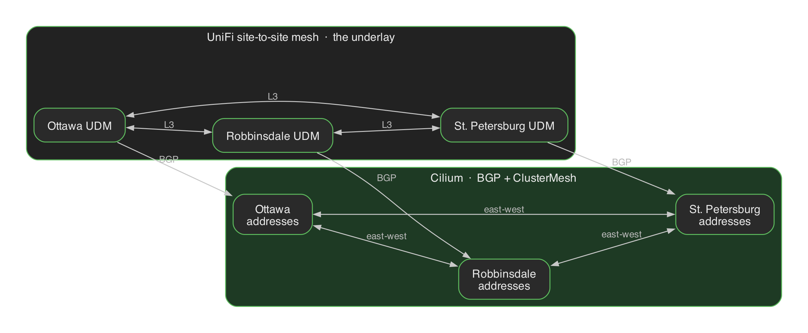
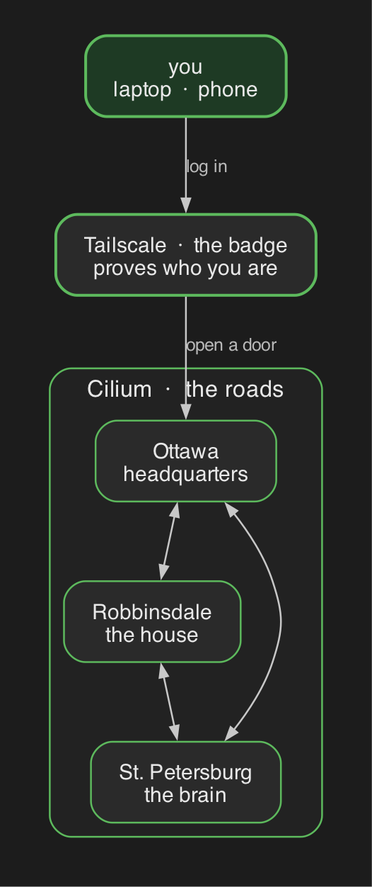
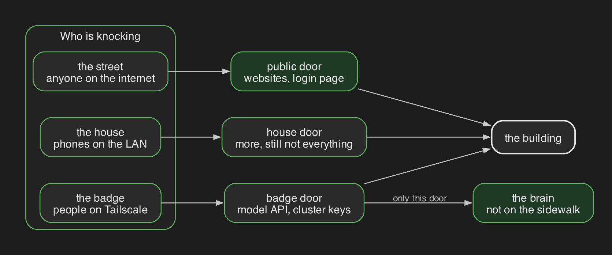
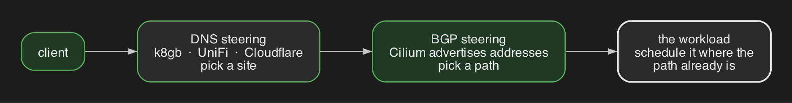
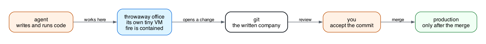

A couple years ago I wrote about my [homelab cluster framework](/p/cluster-framework/). That post was RKE2, Argo CD, and Tailscale as the way clusters talked to each other. The stack has changed a lot since then.

I still run this at home. The difference is I now treat it like a company: git is the source of truth, Flux ships the change, UniFi is the site-to-site mesh, Cilium BGP and ClusterMesh do east-west over that mesh, Tailscale is how I log in, and coding agents do a lot of the walking. I call the shape an AI CDN because the job looks like a CDN. Put the right thing at the right edge, behind the right door. The "thing" used to be a file. Now it is a model, a git commit, or an agent session that is allowed to open a pull request.

Steering is the other half. Once the fabric is a real L3 mesh, you have two knobs: BGP for the packet, DNS for the name. That is what makes distributed scheduling worth talking about.

Live manifests are in [keiretsu-labs/kubernetes-manifests](https://github.com/keiretsu-labs/kubernetes-manifests).

## Helpful Links
- [Kubernetes Manifests](https://github.com/keiretsu-labs/kubernetes-manifests) - GitOps repo for all three clusters
- [Cilium + UniFi BGP](/p/cilium-unifi/) - how pod and service CIDRs hit the LAN
- [Tailscale Operator](/p/tailscale-operator/) - API server proxy, egress, connectors
- [Gateway API + custom domains](/p/byo-domain-gateway-api-tailscale-operator/) - HTTPRoutes on the tailnet

## Components
- **Talos** - Immutable Kubernetes OS. No SSH on the nodes. I used to run RKE2. Talos is better for this.
- **UniFi** - Site-to-site mesh. The underlay. Without this, Cilium has nothing to advertise onto.
- **Cilium** - CNI, BGP into UniFi, ClusterMesh for east-west. Direct routing, no Tailscale hop. Hubble is Wireshark for the mesh.
- **Tailscale Operator** - Identity. `kubectl` over the tailnet, grants, sandbox TUN. Not the backbone.
- **Flux** - GitOps. `main` is the only durable state. If it is not in git, it does not last.
- **Envoy Gateway** - Three Gateways per cluster: `public`, `private`, `ts`.
- **Cloudflare + k8gb** - Public DNS and GSLB for names that actually run in more than one place.
- **Garage** - S3 across all three sites. One zone down is fine. Two is an outage.
- **Forgejo + Woodpecker** - Git and CI, self-hosted.
- **vLLM** - Local model on two DGX Sparks in St. Petersburg.
- **Kata Containers** - Each agent session gets its own VM. gVisor is the cheaper fence.

### The three clusters

I run three Talos clusters. They are not copies of each other.

- **Ottawa** - Headquarters. Git, login, Grafana, the agent control plane, the OCI registry. If Ottawa is down the other two keep running, but you cannot log in, ship, or see dashboards.
- **Robbinsdale** - The house. Home Assistant, media, a second Ceph, a second Garage zone.
- **St. Petersburg** - Inference. Two GB10 Sparks run one vLLM group. Ottawa reaches that model over Cilium, not Tailscale.

### Underlay - UniFi

This is the piece I left out of the last framework post, and it is why the rest of the networking even works.

Each site has a UniFi gateway. The three UDMs are meshed. That is the WAN. Pod CIDRs, service CIDRs, and LoadBalancer ranges only leave a cluster because the UDM already has a path to the other two sites. Cilium does not create that path. Cilium *uses* it.

I wrote the [Cilium + UniFi BGP](/p/cilium-unifi/) walkthrough when this was one cluster talking to one router. Same pattern, three times, plus the mesh between the routers. ClusterMesh API servers sit on pinned LoadBalancer IPs and peer over that UniFi-routed network. The old Tailscale LoadBalancer, mesh ProxyGroup, and east-west egress Services are gone. ClusterMesh has no Tailscale hop.

If the UniFi mesh is down, Hubble still looks fine from inside a cluster and DNS still resolves. Nothing connects. Easy to misread as an ingress or cert problem.

### CNI - Cilium

The reason for choosing Cilium is the same as last time: it is the superior CNI. What changed is I stopped using Tailscale as the path *between* clusters, because UniFi plus BGP made direct routing possible.

Talos ships `cni: none` and kube-proxy off. Cilium is both. Each site has its own Cilium tree on purpose, cluster IDs 1, 2, and 3.

Cilium peers with UniFi over BGP and advertises pod, ClusterIP, and LoadBalancer addresses. All of them. Every pod and every ClusterIP on a site is LAN-routable. ClusterMesh then syncs services and identities so Ottawa can call the model in St. Petersburg by service name. MCS exports, local affinity, cross-cluster failover. Inference, Garage RPC, Woodpecker agents, Mimir, logs all ride that.

That is east-west. Direct. Native routing. No overlay tax for the work the company actually does.

Hubble is still the best debugging tool I have for this. If a packet should not leave a namespace, NetworkPolicy is the lock. Cilium can match on DNS names, which matters once you let an agent make outbound calls.

One thing to say out loud: because BGP advertises ClusterIPs onto the LAN, and the Tailscale subnet router advertises the same ranges, "it is only a ClusterIP" is not security. Use a Gateway policy, a Cilium policy, or a Tailscale grant.

### BGP - local only

Cilium peers with the local UDM. That is enough. The UniFi mesh already moves packets between sites; a second BGP session to the other routers does not add a path. ClusterMesh is services. BGP is "tell my router about this cluster's addresses." Each cluster has its own ASN.

LoadBalancers are two spaces:

- **Per-site** — Tailscale nameserver, PeerRelay, ClusterMesh. Public and private Envoy already share this range; the door is the Gateway, not the subnet.
- **Shared** — a UniFi network every site can see, carved so each cluster allocates from its own slice. Opt in with a label. The mesh routes it because it is a UniFi network, same as the per-site ranges.

### VPN - Tailscale

Tailscale is how a person (or an agent) proves who they are. The operator's API server proxy is how `kubectl` works. The kubeconfig in git has no real credentials. Tailnet identity is the credential. Grants map to Kubernetes groups. The ACL file is the org chart, and it has tests in CI.

I use Tailscale for:

- Cluster API access
- Laptops and phones
- A workspace that needs to join the tailnet from inside its sandbox
- Names that actually need tailnet identity, via an ExternalName Service

I do **not** use it as the road between Ottawa and St. Petersburg. That traffic should feel like a hallway. Most Kubernetes + Tailscale writeups (including [my own operator post](/p/tailscale-operator/)) treat Tailscale as the interconnect. That works. For a three-site setup it is the slow way.

### Ingress - three Gateways

A homelab that only exists on a VPN is a homelab. This has a public path too.

Every cluster gets the same three Gateways from one base:

1. **`public`** - Internet. Cloudflare DNS, Let's Encrypt, the websites a stranger can hit. k8gb load-balances names that actually run in more than one cluster. Names that only exist in Ottawa are pinned there. GSLB with no backend on the other WAN is just a coin flip.
2. **`private`** - LAN. Same certs, no Cloudflare, fewer listeners.
3. **`ts`** - Tailnet only. Split DNS. Cluster control and the model API live here.

The AI-specific split: the model *settings* page can be public, behind login. The model *API* is private/tailnet only. Path and hostname both have to be wrong for a prompt to hit the internet.

### Steering - BGP or DNS

Once you have a UniFi mesh and Cilium advertising CIDRs onto it, you do not need a service mesh sidecar to pick a path. You have two steering planes, and they do different jobs.

**BGP** is the packet, local to the site. Cilium tells that UDM where the pods and ClusterIPs are. The UniFi mesh is how the other sites reach the next-hop. ClusterMesh picks endpoints, with `service.cilium.io/affinity: local` so a request that already landed at a site stays there unless that backend is dead. This is how Ottawa talks to the model, how Garage RPC fans out per node, how Robbinsdale Woodpecker agents reach the Ottawa server. Optimized pathing here means: do not hairpin through Tailscale, do not hairpin through a public Gateway, send the packet on the L3 fabric that already exists.

**DNS** is the name. k8gb for public GSLB. UniFi for the private/LAN view. Tailscale split DNS for the `ts` Gateway. k8gb picks a healthy regional Envoy edge. It does not make a single-region app highly available. DNS never did. Pin names that only have one home.

North-south is DNS then Gateway then, if the backend is exported, MCS. East-west skips DNS and goes ClusterMesh on BGP. Mixing those up is how you get a 404 that looks like a network outage, or a network outage that looks like a cert problem.

The future I actually care about is **distributed scheduling on this fabric**. If every pod is reachable, you can put the work where the GPU is, where the data is, or where the user is, and the path is already there. Steer the client with DNS. Steer the packet with BGP. Schedule the pod on the site that makes both of those cheap. That is path-aware scheduling without inventing a new control plane. Cilium already sees the endpoints. k8gb already sees the edges. The missing piece is treating "which cluster should this agent run on" as a routing decision, not a YAML copy-paste.

I am not running that scheduler yet. The fabric is what makes it possible. Inference already works this way by accident: the model lives in St. Petersburg, the front door lives in Ottawa, ClusterMesh is the path. Agents still mostly land in Ottawa because that is where the workspace control plane is. The next step is obvious once you look at it as steering.

### Inference - vLLM on the Sparks

St. Petersburg serves one model across both Sparks. There is a single endpoint. I do not put a fancy inference router in front of one endpoint. That is a hop and a failure domain for nothing.

Ottawa apps talk to it over ClusterMesh. CLIProxy on Ottawa is the front door clients see. If the Sparks are down, it can fail over to a rented model. The GPU is not the public hostname.

### Sandboxing - Kata

Coding agents execute whatever they just wrote. Default containers share the host kernel. That is fine for Flux. It is not fine for a workspace.

Every user workspace runs in Kata: a small VM, its own kernel. Trash the room, the room dies. A separate RuntimeClass is the only one allowed to open a TUN and run Tailscale *inside* the sandbox. Ordinary workspaces do not get that. If every sandbox is a VPN node, you did not sandbox anything.

Network policy is the other half. Locks go on the thing being protected, not only on the agent. Once traffic is on Tailscale, source policy cannot always see the final destination.

This summer researchers showed Cursor, Codex, and Gemini CLI did not need to "break out" of their sandboxes. The agent wrote a file and a trusted program on the laptop ran it later. The hole was the handshake. Mine is a merge. The agent can wreck its VM. Production changes when I accept a commit.

### GitOps - Flux

I used to run Argo CD. Flux is what ships this repo. A pointer file in `kubernetes/apps/<cluster>/...` is the deploy decision. No pointer, not deployed. Inventory is generated from those files so the catalog cannot lie.

Agents read the repo. Local gates render all three clusters before commit. GitHub Actions does it again. Merge to `main`. Flux is the only writer. Secrets are SOPS. There is no `kubectl apply` that lasts.

That is the factory. Agents write. Checks run. I merge. I am not trying to remove myself from the loop. I am trying to make the loop small enough that I can still walk it.

### Storage and the rest

Garage is the object store, three zones. Rook-Ceph is block at Ottawa and Robbinsdale. St. Petersburg is local-path, so a Spark dying is data loss for anything that only lived there. CNPG for Postgres, WAL to Garage. Spegel so nodes share image layers. Zot for OCI, blobs in Garage.

The unglamorous list is the company: cert-manager, DNS-01, encrypted secrets, upgrades that do not take all three sites down at once.

## What breaks

**Ottawa down:** auth, git, CI, Grafana. Other sites keep their pods. You just cannot see them or ship.

**St. Petersburg down:** local inference dies. The factory still merges. Clients fail over through CLIProxy.

**Robbinsdale down:** the house and one Garage/Ceph zone. Ottawa still answers.

I picked those numbers. If you rent the factory, the sandbox, or the GPUs, someone else did.

## Wrapping up

You can rent a coding agent, a GPU, and a sandbox. All three got good. What you cannot rent is a written copy of how *your* setup actually works, plus a network that turns a change in git into a running object at the right Gateway, as the right identity.

UniFi is the mesh. Cilium BGP and ClusterMesh are east-west on top of it. DNS and BGP are the two steering knobs. Tailscale is how someone proves they belong. Public ingress is how this meets the internet without putting the model on it. Flux ships git. Kata keeps the agents in a VM.

The [manifests](https://github.com/keiretsu-labs/kubernetes-manifests) are the runbook. This post is the current shape of a framework I started writing down in 2024.
