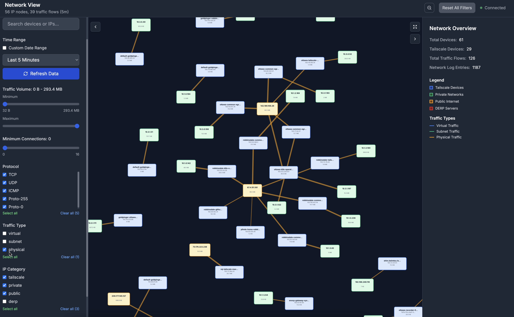
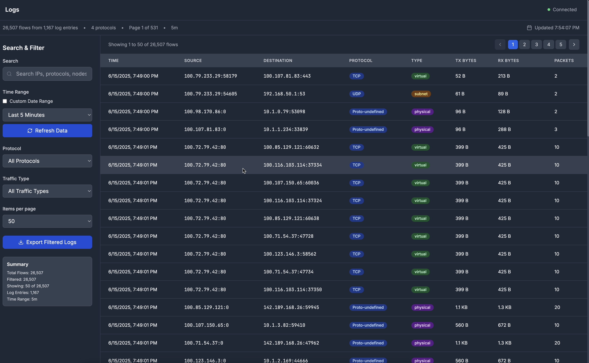

Tailscale is an identity-based service network layer. Often times when your tailnet is large and you have just pushed a new ACL config, it can be hard to tell where the flow of your traffic is originating from and what is the traffic that any particular client is having traffic traverse through.

As organizations scale their Tailscale deployments, network administrators and DevOps teams face an increasingly complex challenge: understanding how traffic flows through their tailnet. With dozens or hundreds of devices, complex ACL policies, and multiple subnets, gaining visibility into network patterns becomes critical for security, performance, and troubleshooting.

That's why we built **[TSFlow](https://github.com/rajsinghtech/tsflow)** - a modern, real-time web application that transforms your Tailscale network logs into beautiful, interactive visualizations that make network traffic patterns immediately clear.

## The Challenge: Network Visibility at Scale

When your tailnet grows beyond a handful of devices, several pain points emerge:

- **ACL Complexity**: After deploying new access control policies, it's difficult to verify they're working as intended
- **Traffic Patterns**: Understanding which devices communicate with each other and how frequently
- **Performance Issues**: Identifying bandwidth-heavy connections or unusual traffic spikes
- **Security Monitoring**: Detecting unexpected communication patterns that might indicate security issues
- **Compliance**: Demonstrating network segmentation and access controls for audit purposes

Traditional network monitoring tools weren't designed for the modern, identity-based networks that Tailscale enables. We needed something purpose-built for the Tailscale ecosystem.

## Introducing TSFlow: Network Visualization Made Simple

TSFlow bridges this gap by leveraging Tailscale's powerful [Network Flow Logging API](https://tailscale.com/api#tag/logging/GET/tailnet/{tailnet}/logging/configuration) to create intuitive, real-time visualizations of your network traffic. Built as a modern web application with a Go backend and React frontend, TSFlow transforms raw network logs into actionable insights.

<video width="100%" controls autoplay muted loop>
    <source src="tsflow.mp4" type="video/mp4">
    Your browser does not support the video tag.
</video>

### Key Features

**🌐 Interactive Network Topology**
- Force-directed graphs show device relationships at a glance
- Real-time traffic flow animations reveal active connections
- Multiple layout algorithms (force-directed, circular, grid, hierarchical) for different perspectives
- Zoom and pan controls for detailed exploration of large networks



**📊 Comprehensive Analytics**
- Live traffic metrics and bandwidth utilization
- Protocol breakdown (TCP, UDP, ICMP) with detailed statistics
- Device activity monitoring across your entire tailnet
- Historical trend analysis with customizable time ranges



**🔍 Advanced Filtering**
- Flexible time range selection from 5 minutes to custom date ranges
- Protocol-based filtering to focus on specific traffic types
- Traffic categorization (virtual, subnet, physical)
- Device and tag-based filtering for targeted analysis

**🎯 Device Management**
- Real-time device status monitoring (online/offline)
- Detailed device metadata including OS, version, and connectivity
- Tag-based organization matching your Tailscale configuration


## Real-World Use Cases

### ACL Validation
After deploying new access control policies, TSFlow makes it easy to verify they're working correctly. The network topology view immediately shows which devices can communicate, while the traffic logs confirm that blocked connections are indeed being denied.

### Performance Troubleshooting
When users report slow network performance, TSFlow's bandwidth visualization quickly identifies high-traffic connections and potential bottlenecks. The protocol breakdown helps distinguish between different types of traffic and their impact.

### Security Monitoring
Unusual traffic patterns become immediately visible in TSFlow's real-time visualizations. Whether it's unexpected device-to-device communication or traffic volume spikes, security teams can quickly identify and investigate potential issues.

### Network Documentation
TSFlow's clear visualizations serve as living documentation of your network topology, making it easier to onboard new team members and communicate network architecture to stakeholders.

## Getting Started

TSFlow is designed to be deployed alongside your existing infrastructure with minimal configuration. Here's how to get started:

### Prerequisites
- A Tailscale API key with `devices:read` and `logs:read` permissions
- Docker (recommended) or Go 1.21+ and Node.js 18+

### Quick Start with Docker

```bash
# Run TSFlow with your Tailscale credentials
docker run -d \
  --name tsflow \
  -p 8080:8080 \
  -e TAILSCALE_API_KEY=your-api-key \
  -e TAILSCALE_TAILNET=your-tailnet \
  -e ENVIRONMENT=production \
  --restart unless-stopped \
  ghcr.io/rajsinghtech/tsflow:latest

# Access the dashboard
open http://localhost:8080
```